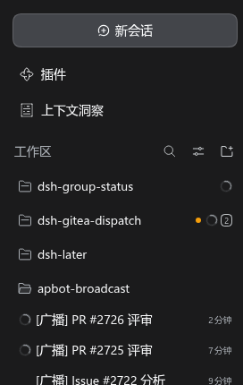
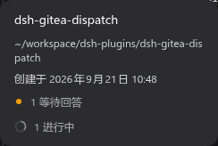

<div align="center">


# dsh-group-status — 收起的分组也看得见活

**中文** | [English](./README.en.md)

[](https://github.com/WuJiaoJue/dsh-group-status)
[](LICENSE)
[](https://github.com/deepseek-ai/deepseek-harness)

</div>

> DSH 侧栏里**分组一收起，里面会话的状态就跟着折叠消失**——进行中、待审批、等待评审全看不见了。这个插件让收起的文件夹行自己长出聚合徽标：**黄点待审批、转圈进行中**，再挂上定时任务与等待评审两个图标，带数字、悬停看明细；展开后一个像素都不改，子行自带状态。

---

## 效果预览

**收起的文件夹行自带聚合徽标** —— 上面 `dsh-group-status` 有 1 个会话进行中（转圈），下面 `dsh-gitea-dispatch` 有 1 个等待回答 + 1 个进行中（黄点 + 图标 + 数字 `2`）：

<p align="center">

</p>

**悬停看明细** —— hover 卡在原路径、创建时间下面追加聚合明细行：

<p align="center">

</p>

> 徽标复用的就是 DSH 原生 `StateDot`，颜色与行内状态同源，不会走样。上面两张是实机截图。

---

## 使用方法

收起任意有活会话的分组，文件夹名后面出现徽标：

| 符号 | 含义 | 颜色 |
|---|---|---|
| 黄点 | 组内有待审批 / 计划待审 / 待回答 | warning（与行内一致）|
| 转圈 | 组内有进行中（含运行中的子智能体） | ongoing（`StateDot` 转圈动画）|
| 时钟 | 组内有定时任务（数据来自 dsh-later） | 紫 · 橙（≤5 分钟）· 红（已到期）|
| 列表笔 | 组内有等待评审的 PR（数据来自 dsh-gitea-dispatch） | 琥珀 · 红（已超时）|

规则：

- **已完成不进徽标**：`done`（已完成未读）是子行自己的事，折叠行只提示「需要你」和「在跑」——一组只剩已完成时徽标不出现。（这个取舍来自 `6db1fd3`：completed 归会话行，不归文件夹提示。）
- **数字** = 待审批 + 进行中 + 有定时任务的会话 + 等待评审的会话（**不含已完成**）；有徽标就带数字，只有一个会话时也会显示 `1`。
- **悬停明细**：文件夹行 hover 卡在路径、创建时间下面，按 `等待审批 · 计划待审 · 等待回答 · 进行中 · 子智能体 · 等待评审 · 定时任务 · 已完成` 的顺序追加明细行，例如 `1 等待回答 · 1 进行中`。
- **展开即让位**：聚合徽标只在折叠时出现；展开后子行自带状态，不重复显示。
- **无障碍**：徽标是 `role="img"` + 本地化 `aria-label`（如 `1 等待回答 · 1 进行中`），悬停 `title` 同文案，读屏与鼠标都读得到。

---

## 特性一览

- **收起可见**：聚合状态只在分组折叠时出现，展开后的侧栏与官方版本逐像素一致。
- **与行内同源**：优先级、颜色、文案全部复用行内状态的派生逻辑与 `StateDot`，跳过空白会话与已归档会话。
- **跨插件聚合**（可选）：dsh-later 的定时任务、dsh-gitea-dispatch 的等待评审，两个都没装也照常工作——见下。
- **零配置**：没有设置项，装上即用。
- **本体零改动**：官方 `dsh-client-ui-workspace` 包文件一个不动；改动全在本仓库源码里，profile 补丁只有两条（装本包、禁用官方行）。
- **多语言**：跟随 DSH 界面语言（中文 / English），复用官方文案键，只新增了 `status.waitingReview` 与 `status.scheduled`。

---

## 跨插件状态（可选）

### 消费方：本插件怎么拿别人的状态

组内会话如果挂着定时任务或等待评审，徽标会各多一个图标。本插件**不自己轮询**，而是向数据源插件要一份摘要：

| 数据源 | 提供 | 消费方接入 |
|---|---|---|
| [dsh-later](https://github.com/WuJiaoJue/dsh-later) | `useScheduleSummary()`：会话 id → `{ count, pausedCount, nextAt, state }` | `require('dsh-later/client')` |
| dsh-gitea-dispatch | `useWaitingSummary()`：会话 id → `{ prNumber, state }` | `require('dsh-gitea-dispatch/client')` |

- 两个插件**未安装 / 未启用时静默降级**：图标不出现，其余徽标照常，不会报错也不会空转。
- 本仓库 `package.json` 的 `dsh.client.external` 声明了这两个外部模块。

### 提供方：想暴露摘要的插件看这里

别的插件要把自己的状态暴露给别人消费，可复用 [`src/client/cross-plugin-summary.ts`](src/client/cross-plugin-summary.ts) 这份骨架：`createSummaryStore`（可订阅 store）+ `createSummaryRegistry`（迟到的 store 自愈）+ `summarizeGroup` / `mapEquals` / `entryFor` / `normalizeSessionId`（折叠与 id 归一）。

> ⚠️ **复制，不要 import。** 跨插件值导入在本项目走不通，实测报错 `Could not resolve "dsh-group-status"`：别的插件不依赖本包，客户端 bundle 又是自包含的闭包工厂，而 bundle 纯净度闸门只拦 `@deepseek-ai/*` 前缀，连"跨插件值导入"的专用报错都不会给。

正确接法：把模板**复制**进 provider 插件 → provider 用 `registry.setStore(store)` 登记、从自己的 client 入口导出 `registry.useSummary` → consumer 再 `require('<provider>/client')` 用它的 hook。模板的每条改进都由 `tests/cross-plugin-summary.node.test.mjs` 锁住。

---

## 快速开始

### 安装到 DSH

本包是一个 **fork 覆盖包**：注册与官方 `dsh-client-ui-workspace` 相同的槽位，并把官方那一行 disable（补丁见 `cordis.patch.yml`）。构建产物随仓库提交，从 GitHub 直接装即可，不需要本地构建：

```bash
dsh plugin --profile web add "github:WuJiaoJue/dsh-group-status"
# 重启 dsh web 后生效（侧栏是整包替换，需重新生成浏览器模块）
```

本机开发时用 link，改完 `src/` 重建即可生效：

```bash
git clone https://github.com/WuJiaoJue/dsh-group-status.git
cd dsh-group-status
pnpm install && pnpm build

dsh plugin --profile web add "link:$PWD"
# 重启 dsh web
```

> 开发提示：`pnpm watch` 监听 `src/` 自动重建；但侧栏是整包替换，**改完仍需重启 dsh web**。

### 验证

1. 找一个有进行中 / 待审批会话的分组 → 收起 → 文件夹名后出现徽标；
2. 悬停文件夹行 → 明细行出现（与徽标文案一致）；
3. 展开分组 → 徽标消失，子行自带状态；
4. 浏览器 console 无报错。

### 回滚

```bash
dsh plugin --profile web remove dsh-group-status
# 两条补丁一起撤，官方行自动回来；重启 dsh web 生效
```

---

## 兼容性

| 项 | 值 |
|---|---|
| DSH 内核 | `0.2.0-rc.2` |
| peer 依赖 | `@deepseek-ai/cordis ~4.0.4` |
| 上游基线 | `@deepseek-ai/dsh-client-ui-workspace 0.2.0-rc.2`（源码已 vendored 进本仓库 `src/`）|
| 安装形态 | fork 覆盖包：同槽位注册 + `cordis.patch.yml` 禁用官方行 |
| 可选搭档 | dsh-later（定时任务摘要）、dsh-gitea-dispatch（等待评审摘要）|

上游一换代就得按[升级手册](./docs/upgrading.md) rebase 一次；上游改槽位名、组件签名或上下文契约时，本包不会自动跟上。

---

## 开发

```sh
pnpm install
pnpm build        # tsc 类型检查 + tsdown 打包 → lib/
pnpm watch        # 监听 src/ 自动重建（改完仍需重启 dsh web，侧栏是整包替换）
pnpm test         # = test:node（node --test，12 用例）+ test:spec（vitest + jsdom，96 用例）
pnpm test:spec    # 只跑上游 spec 套件
```

`tests/` 是上游测试副本，外加本仓库自己的 [tests/group-status.client.spec.ts](tests/group-status.client.spec.ts)——它覆盖折叠聚合本身（计数、待处理类互斥、子智能体、空白/归档跳过、跨插件来源）。

上游另有 7 个 spec 只能在 DSH monorepo 里跑：它们要么依赖 `dsh-client-test-runtime` 对**未发布源码**的深导入，要么从已发布的 `…/client` 产物里取运行期值、而那个闭包要求宿主预载整套依赖。本地在 [vitest.config.ts](vitest.config.ts) 顶部显式跳过了它们，原因逐条写在文件里——**不要用假实现把它们点亮**，那只会测试假实现。

---

## 已知限制

- **上游换代必须手工 rebase**：本包 vendored 了上游源码（`src/`、`tests/`），用的不是稳定公共 API；上游动槽位名、组件签名或上下文契约时要跟着改，步骤见[升级手册](./docs/upgrading.md)。
- **折叠时多一次全量遍历**：聚合计数与展开态共用同一份派生，超大分组（数百会话）每次状态变更多一次 traverse，与展开渲染同量级，可接受。
- **状态不自己产生**：跨插件图标完全依赖 dsh-later / dsh-gitea-dispatch 暴露的摘要 API，它们不装就只是没有那两个图标，不影响本体。
- **数字比明细粗**：定时任务按「组内有定时任务的会话数」计，不按任务条数累计；具体条数在 dsh-later 自己的界面上看。
- **只覆盖侧栏折叠态**：本插件只加聚合显示，不改会话状态机、不改行内 badge 的判据。

---

## 技术文档

- [上游升级手册](./docs/upgrading.md) — 基线怎么来的、本地改了哪几处、上游换代时怎么 rebase 与验证
- [跨插件摘要模板](./src/client/cross-plugin-summary.ts) — 提供方（provider）侧骨架本体，文件头就是它的设计说明与「复制、不要 import」的实测依据

## 许可

MIT（沿用上游 `@deepseek-ai/dsh-client-ui-workspace`）。

---

<div align="center">


</div>
